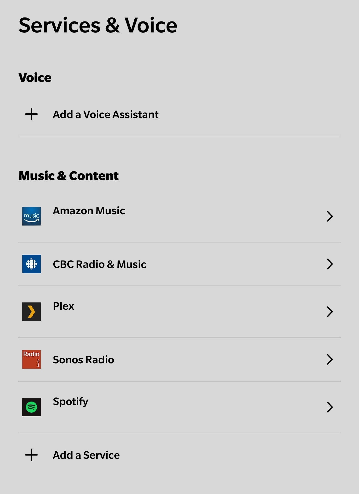
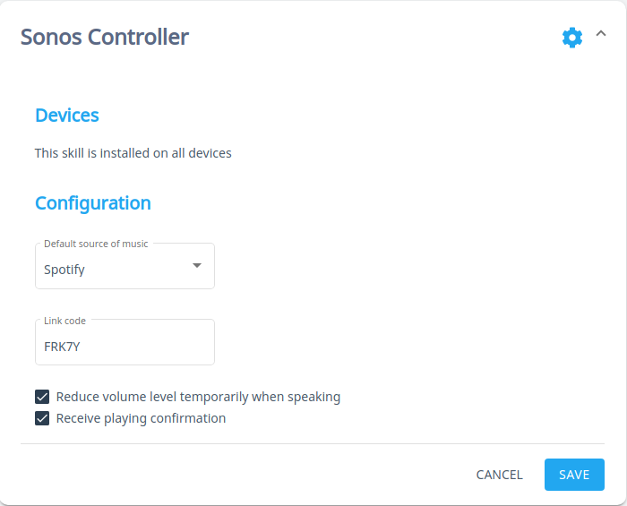
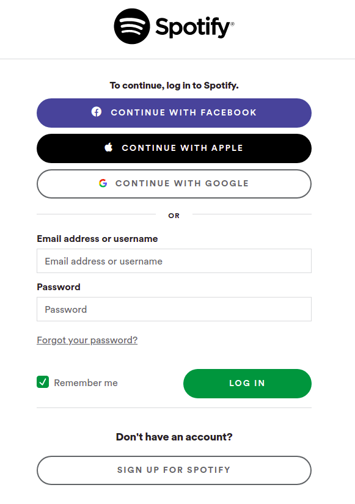
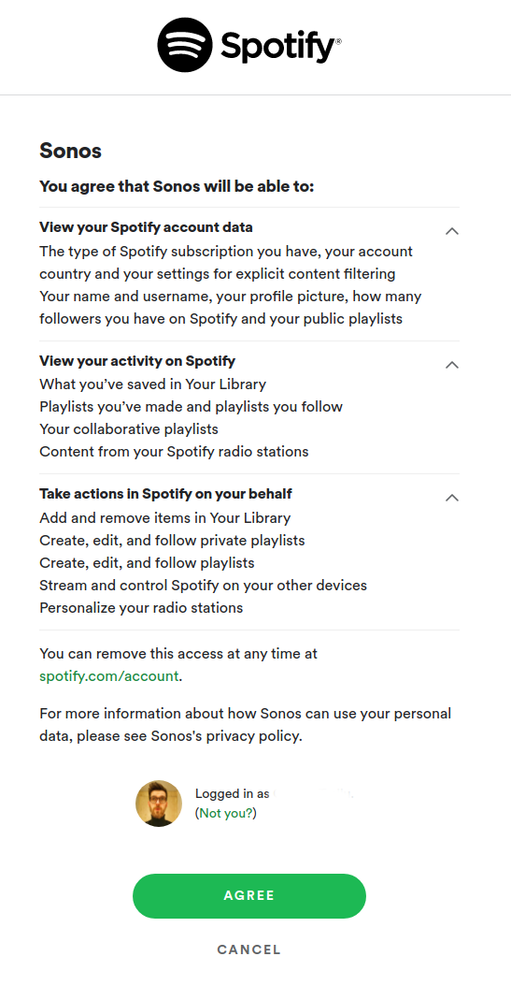

[](https://travis-ci.com/github/smartgic/mycroft-sonos-controller-skill) [](https://opensource.org/licenses/MIT) [](https://github.com/smartgic/mycroft-sonos-controller-skill/pulls) [](https://mycroft.ai) [](https://discord.gg/sHM3Duz5d3)

<p align="center">
  
</p>

# Sonos Controller

Control Sonos speakers with music services support such as Spotify, Deezer, Amazon Music, etc...

## Disclaimer

This plugin is not officially commissioned/supported by Sonos. The trademark "Sonos" is registered by "Sonos, Inc."

## About

[Sonos](https://www.sonos.com) is the ultimate wireless home sound system: a whole-house WiFi network that fills your home with brilliant sound, room by room.

This skill interacts with your Sonos devices and allows you to play music from different music sources such as:

* Local library
* Spotify *(account required)*
* Deezer *(account required)*
* Amazon Music *(account required)*

Before using a music service, **make sure that you linked** your service account to your Sonos devices by using the Sonos application:



## Examples

* "play i got a feeling on living room"
* "play i got a feeling by black eyed peas on living room"
* "play i got a feeling from spotify on living room"
* "play i got a feeling by black eyed peas from spotify on living room"
* "play soundtrack playlist on dining room"
* "play soundtrack playlist from spotify on dining room"
* "play soundtrack album on dining room"
* "play back to front album by lionel richie on dining room"
* "play back to front album by lionel richie from spotify on dining room"
* "play soundtrack album from spotify on dining room"
* "discover sonos devices"
* "what is playing"
* "which artist is playing"
* "what are my music services"
* "volume louder"
* "volume quieter"
* "volume down on living room"
* "volume up"
* "quieter"
* "louder"
* "pause music"
* "stop music"
* "resume music"
* "shuffle off"
* "shuffle on"
* "disable repeat mode"
* "enable repeat mode"
* "next music"
* "previous music"
* "give me information on dining room device"
* "gime me detailed information about library speaker"

## Installation

Make sure to be within the Mycroft `virtualenv` before running the `msm` command.

```shell
$ . mycroft-core/venv-activate.sh
$ msm install https://github.com/smartgic/mycroft-sonos-controller-skill.git
```

## Configuration

This skill utilizes the `settings.json` file which allows you to configure this skill via `home.mycroft.ai` after a few seconds of having the skill installed you should see something like below in the https://home.mycroft.ai/#/skill location:



Fill this out with your appropriate information and hit the `save` button.

When Spotify music service is selected Mycroft will speak to you with a URL and code to follow. This URL is https://sonos.smartgic.io/CODE where `CODE` will be automatically and randomly generated by Mycroft and spoken to you *(e.g. Visit sonos.smartgic.io/FRK7Y)*.

https://sonos.smartgic.io is a URL shortener system which will temporary store the music service authentication URL. Once the authentication is done, the URL will be deleted from the URL shortener system.

This link will redirect you to the music service authentication login page using `https` protocol.





Once you successfully logged to Spotify, enter the same code as provided before into the `Link Code` field. Mycroft will confirm the configuration and gives you some example of what you could say.

## Credits

* [Smart'Gic](https://smartgic.io/)
* [SoCo](https://github.com/SoCo/SoCo)
* [@rbcolom](https://github.com/rbcolom) - Italian translation

## Category

**Music & Audio**

## Tags

#music
#audio
#sonos
#sound
#smarthome
#spotify
#deezer
