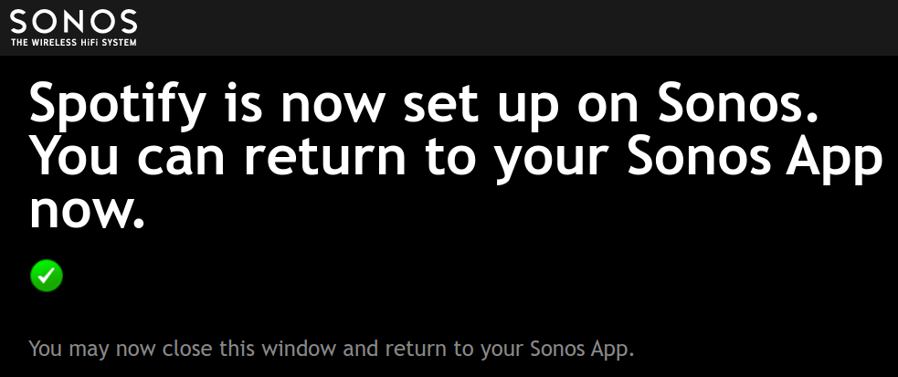

# Sonos Controller

[](https://opensource.org/licenses/MIT)
[](https://github.com/smartgic/sonos-controller-skill/pulls) [](https://openvoiceos.com)
[](https://discord.gg/sHM3Duz5d3)

Control Sonos speakers with music services support such as Spotify, Deezer, Amazon Music, etc...

## Disclaimer

_This skill is not officially commissioned/supported by Sonos. The trademark "Sonos" is registered by "Sonos, Inc."_

## About

[Sonos](https://www.sonos.com) is the ultimate wireless home sound system: a whole-house WiFi network that fills your home with brilliant sound, room by room.

This skill interacts with your Sonos devices and allows you to play music from different music sources such as:

- Local library
- Amazon Music _(account required)_
- Deezer _(account required)_
- Plex _(account required)_
- Spotify _(account required)_
- Tidal _(account required)_

Before using a music service, **make sure that you linked** your service account to your Sonos devices by using the Sonos application:


## Examples

- "play i got a feeling on living room"
- "play i got a feeling by black eyed peas on living room"
- "play i got a feeling from spotify on living room"
- "play i got a feeling by black eyed peas from spotify on living room"
- "play soundtrack playlist on dining room"
- "play soundtrack playlist from spotify on dining room"
- "play soundtrack album on dining room"
- "play back to front album by lionel richie on dining room"
- "play back to front album by lionel richie from spotify on dining room"
- "play soundtrack album from spotify on dining room"
- "play the mysterious universe podcast from plex on office"
- "discover sonos devices"
- "what is playing"
- "which artist is playing"
- "what are my music services"
- "volume louder"
- "volume quieter"
- "volume down on living room"
- "volume up"
- "quieter"
- "louder"
- "pause music"
- "stop music"
- "stop the music on office speaker"
- "resume music"
- "shuffle off"
- "shuffle on"
- "disable repeat mode"
- "enable repeat mode"
- "next music"
- "previous music"
- "give me information on dining room speaker"
- "give me detailed information about library speaker"

## Installation

When using `ovos-core`, two approaches are available to install this skill.

The first one will be to use `pip` and install the skill at the same "place" as `ovos-core`, sharing Python libraries.

```bash
pip install git+https://github.com/smartgic/mycroft-sonos-controller-skill.git
```

The second one will be to run the skill as standalone within a container. Run the `docker compose` command but before edit the `.env` environment file if required.

```bash
cd docker
docker compose up -d
```

## Configuration

This skill utilizes the `settings.json` file which allows you to configure it. This file is available at `~/ovos/config/skills/skill-sonos-controller.smartgic/settings.json`.

| Option           | Value                                                                 | Description                                                         |
| ---------------- | --------------------------------------------------------------------- | ------------------------------------------------------------------- |
| `default_source` | `music library`, `amazon music`, `deezer`, `plex`, `spotify`, `tidal` | Default source of music to play from                                |
| `link_code`      | `ABCD`                                                                | Link code spoken by the skill _(Visit sonos.smartgic.io/ABCD)_      |
| `duck`           | `true`, `false`                                                       | Reduce volume level temporarly when speaking _(wake word detected)_ |
| `confirmation`   | `true`, `false`                                                       | Receive playing confirmation                                        |

To authenticate to Spotify music service:

```json
{
  "__mycroft_skill_firstrun": false,
  "confirmation": true,
  "default_source": "spotify",
  "duck": true
}
```

When Spotify music service is selected OVOS will speak to you with a URL and code to follow. This URL is <https://sonos.smartgic.io/CODE> where `CODE` will be automatically and randomly generated by OVOS and spoken to you _(e.g. Visit sonos.smartgic.io/FRK7Y)_.

<https://sonos.smartgic.io> is a URL shortener system which will temporary store the music service authentication URL. Once the authentication is done, the URL will be deleted from the URL shortener system.

This link will redirect you to the music service official authentication login page using secured protocol.




Once successfully logged to Spotify, enter the same code as provided before into `~/ovos/config/skills/skill-sonos-controller.smartgic/settings.json` using the `link_code` key.

```json
{
  "__mycroft_skill_firstrun": false,
  "confirmation": true,
  "default_source": "spotify",
  "duck": true,
  "link_code": "FRK7Y"
}
```

OVOS will confirm the success of the authentification and gives you some example of what you could say.

## Supported languages

- English
- French
- German
- Italian

## Credits

- [Smart'Gic](https://smartgic.io/)
- [SoCo](https://github.com/SoCo/SoCo)
- [@rbcolom](https://github.com/rbcolom) - Italian translation
